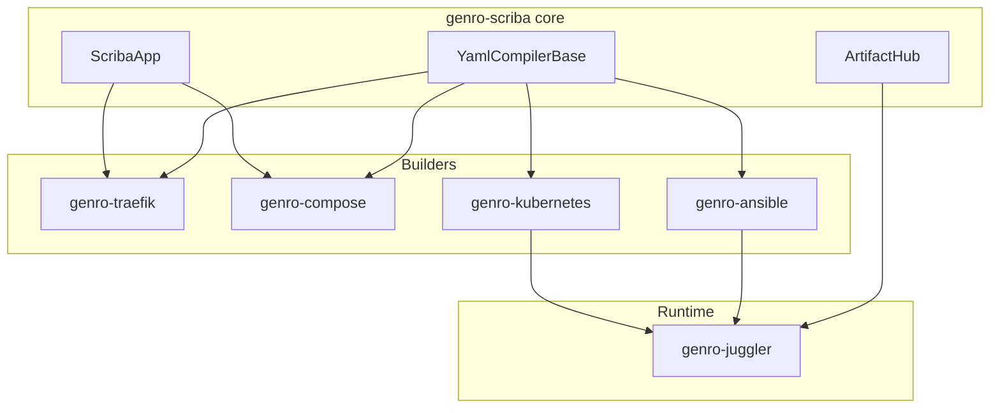

# Genro Scriba

[](https://github.com/genropy/genro-scriba)

**Infrastructure configuration file generator for Genropy** — write infrastructure as Python, not YAML.

genro-scriba is the core package that provides `ScribaApp`, `YamlCompilerBase`, and `ArtifactHub` integration. Individual tools are in separate packages:

| Package | Description |
|---------|-------------|
| **genro-traefik** | Traefik v3 reverse proxy configuration (~150 elements) |
| **genro-compose** | Docker Compose files (~15 elements + components) |
| **genro-kubernetes** | Kubernetes manifests (~20 elements + import from YAML/Helm) |
| **genro-ansible** | Ansible playbooks (play, task with args_* convention) |
| **genro-juggler** | Reactive infrastructure bus — apply recipes to live targets |

## Architecture



## Quick Example

```python
from genro_scriba import ScribaApp

class MyInfra(ScribaApp):
    def traefik_recipe(self, root):
        root.entryPoint(name="web", address=":80")
        http = root.http()
        http.routers().router(name="api", rule="Host(`api.example.com`)",
                              service="api-svc", entryPoints=["web"])

    def compose_recipe(self, root):
        app = root.service(name="api", image="^api.image")
        app.port(published=8080, target=80)
        root.postgres(name="db")

infra = MyInfra(data={"api.image": "myapp:v1"})
print(infra.to_yaml("traefik"))
print(infra.to_yaml("compose"))
```

---

```{toctree}
:maxdepth: 1
:caption: Start Here
:hidden:

getting-started
```

```{toctree}
:maxdepth: 2
:caption: API Reference
:hidden:

reference/scriba-app
reference/yaml-compiler
reference/artifact-hub
```
