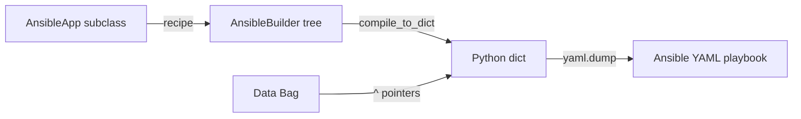

# Genro Ansible

[](https://github.com/genropy/genro-ansible)

**Ansible playbook builder for Genropy** — write playbooks as Python programs.

## How It Works



1. **Subclass** `AnsibleApp` and override `recipe(root)`
2. **Build** using elements: play, task with `args_*` flat params
3. **Compile** to YAML with `to_yaml()`

## Quick Example

```python
from genro_ansible import AnsibleApp

class ServerSetup(AnsibleApp):
    def recipe(self, root):
        play = root.play(name="Setup servers", hosts="^target_hosts", become=True)
        play.task(name="Install nginx", module="apt",
                  args_name="nginx", args_state="present")
        play.task(name="Start nginx", module="systemd",
                  args_name="nginx", args_state="started", args_enabled=True)

app = ServerSetup(data={"target_hosts": "web-servers"})
print(app.to_yaml())
```

## Conventions

- `args_*` parameters become flat module arguments (`args_name` → `name:`)
- `$var` in values becomes `{{ var }}` in YAML (Ansible variable syntax)
- `^path` references shared data from the Bag (scriba pointer syntax)

---

**Next:** [Getting Started](getting-started.md)

```{toctree}
:maxdepth: 1
:caption: Start Here
:hidden:

getting-started
```

```{toctree}
:maxdepth: 1
:caption: API Reference
:hidden:

reference/ansible-app
reference/ansible-builder
reference/ansible-compiler
```
