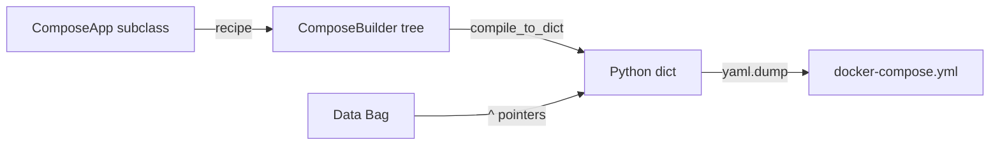

# Genro Compose

[](https://github.com/genropy/genro-compose)

**Docker Compose configuration builder for Genropy** — write Compose files as Python programs, not YAML.

## How It Works



1. **Subclass** `ComposeApp` and override `recipe(root)`
2. **Build** using the builder API (~15 elements + 4 mixins + 2 components)
3. **Compile** to YAML with `to_yaml()`

## Quick Example

```python
from genro_compose import ComposeApp

class MyStack(ComposeApp):
    def recipe(self, root):
        app = root.service(name="web", image="nginx:alpine")
        app.port(published=80, target=80)
        app.environment(name="ENV", value="production")

        root.postgres(name="db", version="16-alpine")

stack = MyStack()
print(stack.to_yaml())
```

---

**Next:** [Getting Started](getting-started.md)

```{toctree}
:maxdepth: 1
:caption: Start Here
:hidden:

getting-started
```

```{toctree}
:maxdepth: 1
:caption: API Reference
:hidden:

reference/compose-app
reference/compose-builder
reference/compose-compiler
```
