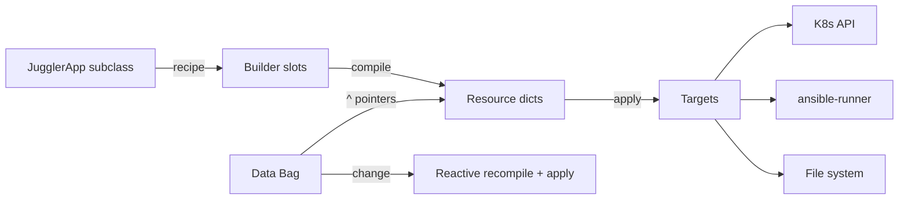

# Genro Juggler

[](https://github.com/genropy/genro-juggler)

**Reactive infrastructure bus for Genropy** — apply genro-scriba recipes to live targets.

## How It Works



1. **Subclass** `JugglerApp` with `kubernetes_recipe()` and/or `ansible_recipe()`
2. **Assign targets** — where compiled resources are applied
3. **Change data** — reactive pipeline recompiles and re-applies affected slots

## Quick Example

```python
from genro_juggler import JugglerApp
from genro_juggler.targets import MockK8sTarget

class MyInfra(JugglerApp):
    def kubernetes_recipe(self, root):
        dep = root.deployment(name="api", image="^api.image", replicas=3)
        c = dep.container(name="api", image="^api.image")
        c.port(container_port=8080)
        root.service(name="api")

app = MyInfra(
    targets={"kubernetes": MockK8sTarget()},
    data={"api.image": "myapp:v1"},
)

# Change data → reactive recompile + apply
app.data["api.image"] = "myapp:v2"
```

## CLI

```bash
juggler run infra.py           # Run with remote server
juggler connect my_infra       # Connect REPL
juggler yaml infra.py          # Dry-run: print YAML
juggler dashboard infra.py     # TUI dashboard (tmux split)
```

---

**Next:** [Getting Started](getting-started.md)

```{toctree}
:maxdepth: 1
:caption: Start Here
:hidden:

getting-started
cli
```

```{toctree}
:maxdepth: 1
:caption: API Reference
:hidden:

reference/juggler-app
reference/targets
reference/remote
reference/dashboard
```
