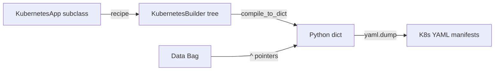

# Genro Kubernetes

[](https://github.com/genropy/genro-kubernetes)

**Kubernetes manifest builder for Genropy** — write K8s manifests as Python programs.

## How It Works



1. **Subclass** `KubernetesApp` and override `recipe(root)`
2. **Build** using ~20 elements: deployment, service, ingress, secret, configmap, etc.
3. **Compile** to multi-document YAML with `to_yaml()`

## Quick Example

```python
from genro_kubernetes import KubernetesApp

class MyApp(KubernetesApp):
    def recipe(self, root):
        dep = root.deployment(name="api", image="^api.image", replicas=3)
        c = dep.container(name="api", image="^api.image")
        c.port(container_port=8080)

        svc = root.service(name="api")
        svc.service_port(port=80, target_port=8080)

app = MyApp(data={"api.image": "myapp:v1"})
print(app.to_yaml())
```

## Import from Existing

Convert existing YAML manifests or Helm charts to Python recipes:

```python
from genro_kubernetes import recipe_from_manifest, recipe_from_helm

# From YAML file
code = recipe_from_manifest("deployment.yaml")

# From Helm chart
code = recipe_from_helm("./my-chart/", release_name="prod")
```

---

**Next:** [Getting Started](getting-started.md)

```{toctree}
:maxdepth: 1
:caption: Start Here
:hidden:

getting-started
```

```{toctree}
:maxdepth: 1
:caption: API Reference
:hidden:

reference/kubernetes-app
reference/kubernetes-builder
reference/kubernetes-compiler
reference/recipe-from-manifest
```
