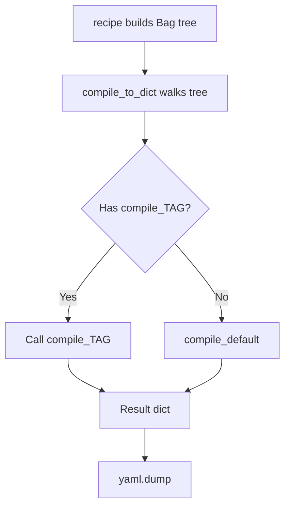

# Concepts

## The Recipe Pattern

A genro-traefik configuration is a Python class that inherits from `TraefikApp`:

```python
class MyProxy(TraefikApp):
    def recipe(self, root):
        # root is the traefik builder node — add sections to it
        ...
```

The `recipe()` method builds a tree of configuration nodes using the builder API. This tree is then compiled to a Python dictionary and serialized to YAML.

## Static vs Dynamic Configuration

Traefik v3 has two configuration layers:

**Static** — defined at startup, requires restart to change:
- `entryPoint` — network listeners (ports)
- `certificateResolver` — TLS certificate automation (ACME/Let's Encrypt)
- `providers` — where Traefik discovers services (Docker, file, Kubernetes)
- `api` — dashboard and debug endpoints
- `log`, `accessLog` — logging configuration
- `metrics`, `tracing`, `ping` — observability

**Dynamic** — can change at runtime:
- `http` / `tcp` / `udp` — protocol-specific routing
  - `routers` — match incoming requests
  - `services` — define backend pools
  - `middlewares` — transform requests/responses

## The Builder

`TraefikBuilder` defines ~150 `@element` methods, one for each Traefik configuration entity. Each element:

- Has **typed parameters** matching Traefik's YAML schema (camelCase)
- Has a **docstring** explaining the Traefik concept
- May have **sub_tags** defining allowed children (with cardinality)
- May have a **compile_*** method for custom YAML rendering

The builder IS the documentation — every `@element` docstring is a reference for the corresponding Traefik concept.

## The Compile Pipeline



1. `recipe()` builds a tree of `BagNode` objects using the builder API
2. `compile_to_dict()` walks the tree, calling `compile_*` methods on the builder
3. Each `compile_*` method decides how to render that node to a dict
4. `yaml.dump()` serializes the dict to YAML

## Middleware Types

Traefik supports 23+ HTTP middleware types. Each is an `@element` in the builder:

| Category | Middlewares |
|----------|-----------|
| **Auth** | `basicAuth`, `digestAuth`, `forwardAuth` |
| **Security** | `headers`, `ipAllowList` |
| **Traffic** | `rateLimit`, `inFlightReq`, `retry`, `circuitBreaker` |
| **Transform** | `stripPrefix`, `addPrefix`, `replacePath`, `replacePathRegex` |
| **Redirect** | `redirectScheme`, `redirectRegex` |
| **Other** | `chain`, `compress`, `buffering`, `errorsPage`, `grpcWeb` |

All middlewares are children of `http.middlewares()` and follow the same pattern:

```python
mw = http.middlewares()
mw.basicAuth(name="auth", users=["admin:hash"])
mw.rateLimit(name="rl", average=100, burst=50)
mw.chain(name="secure", middlewares=["auth", "rl"])
```
