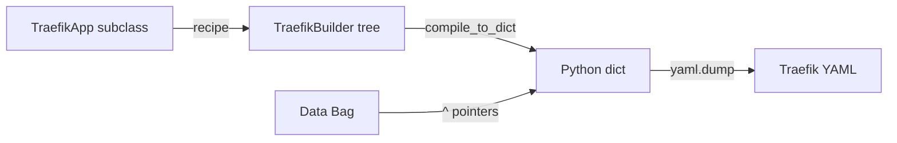

# Genro Traefik

[](https://github.com/genropy/genro-traefik)
[](https://pypi.org/project/genro-traefik/)

**Traefik v3 configuration builder for Genropy** — write Traefik configs as Python programs, not YAML files.

## Why?

YAML is great for simple configs. But when you have multiple services, environments, and shared conventions, YAML becomes copy-paste with manual coordination. genro-traefik lets you use Python's full power — loops, conditionals, parameters, inheritance — to generate validated Traefik YAML.

## How It Works



1. **Subclass** `TraefikApp` and override `recipe(root)`
2. **Build** the config tree using the builder API (~150 elements covering all of Traefik v3)
3. **Compile** to YAML with `to_yaml()` — validated, formatted, ready for Traefik

## Quick Example

```python
from genro_traefik import TraefikApp

class MyProxy(TraefikApp):
    def recipe(self, root):
        root.entryPoint(name="web", address=":80")
        root.entryPoint(name="websecure", address=":443")

        http = root.http()
        r = http.routers().router(
            name="api", rule="Host(`api.example.com`)",
            service="api-svc", entryPoints=["websecure"])
        r.routerTls(certResolver="letsencrypt")

        svc = http.services().service(name="api-svc")
        svc.loadBalancer().server(url="http://localhost:8080")

proxy = MyProxy()
print(proxy.to_yaml())
```

---

**Next:** [Getting Started](getting-started.md)

```{toctree}
:maxdepth: 1
:caption: Start Here
:hidden:

getting-started
```

```{toctree}
:maxdepth: 2
:caption: Concepts
:hidden:

concepts
data-pointers
validation
recipe-from-yaml
```

```{toctree}
:maxdepth: 1
:caption: API Reference
:hidden:

reference/traefik-app
reference/traefik-builder
reference/traefik-compiler
reference/recipe-from-yaml
```
